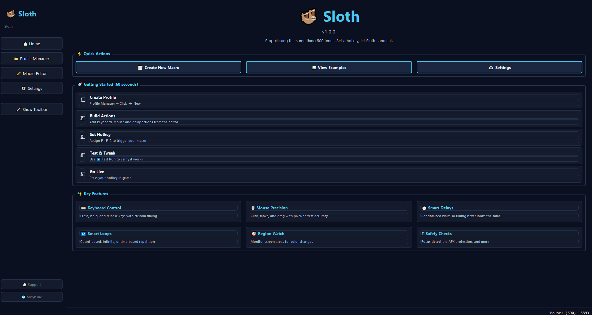
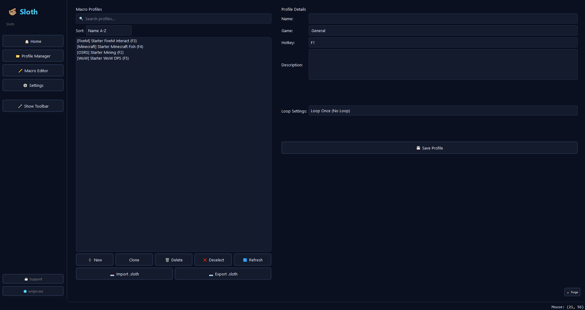
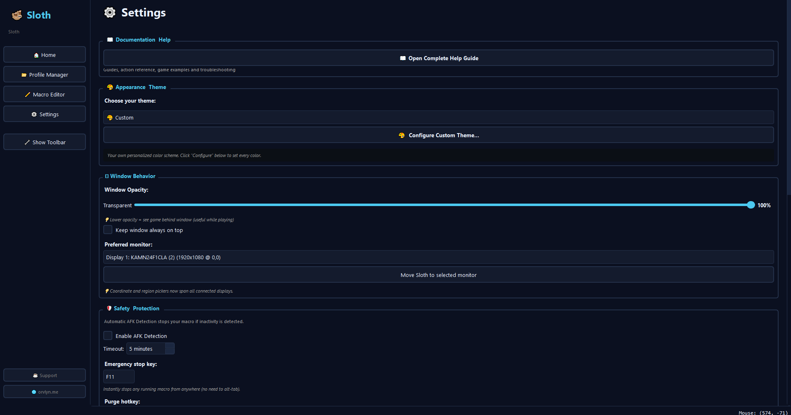

# Sloth

A macro automation tool for Windows. Built mainly for games like OSRS, FiveM, Minecraft and WoW but it works for any repetitive task.

 

## Download

Grab the latest `Sloth.exe` from [Releases](https://github.com/Orvlyn/Sloth/releases/latest). Drop it in its own folder and run it - no installer needed.

After first launch the folder looks like this:

```
SlothFolder/
    Sloth.exe
    profiles/       <- your macros live here
    backups/        <- auto-backup every 6 hours
    sloth.log       <- check this if something goes wrong
```

---

## Previews






---

## What it does

- Keyboard and mouse macros with loops, delays and conditionals
- Pixel and region color watching - great for detecting health bars, inventory states, ore depletion, etc.
- Image matching on screen
- Live macro recorder - just record a sequence and play it back
- F1-F12 hotkeys, one per profile
- AFK detection and safety timeouts so macros stop if you go idle
- OCR for reading digits off screen (FiveM skill checks, etc.)
- 16 built-in themes plus a custom color picker

---

## Running from source

Python 3.10+ required.

```bash
pip install -r requirements.txt
python Sloth.py
```

PySide6 and pynput are the only hard requirements. Everything else is optional - if a package isn't installed the features that depend on it are disabled and noted in `sloth.log`.

---

## OCR / Skill Check Digits (optional)

Only needed for the Skill Check Digits action. Tesseract can't be bundled in the exe so you have to drop it in yourself:

1. Download from https://github.com/tesseract-ocr/tesseract
2. Put it next to `Sloth.exe` like this:

```
SlothFolder/
    Sloth.exe
    tesseract/
        tesseract.exe
        tessdata/
```

Sloth finds it automatically on startup.

---

## Profiles

Profiles are stored as JSON files in `profiles/`. You can export them as `.sloth` files from within the app to share or move between machines. They're just renamed JSON so you can edit them manually if needed.

---

## Notes

- Run as Administrator if hotkeys aren't working - some games block low-level input hooks
- Using macros in online games may violate their Terms of Service. Use at your own risk

